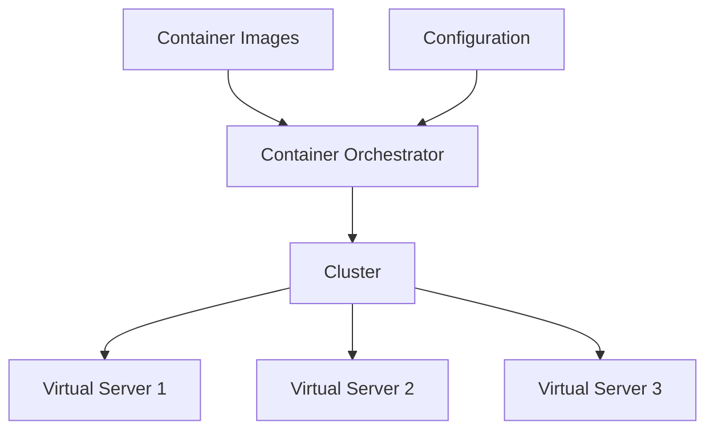

# Container Orchestration

Requirement: I want to run 10 instances of M1, 15 instances
of M2, and so on ...
Furthermore, I need:
- Auto Scaling --> Scale containers based on demand.
- Service Discovery --> Help microservices find each other.
- Load Balancer --> Distribute load among multiple instances.
- Self Healing --> Perform health checks and replace failing
instances.
- Zero Downtime Deployment --> Release new versions without
downtime.

Amazon Web Services provides:
- AWS Elastic Container Service (ECS)
- AWS Fargate: "Serverless" version of ECS.

However, a cloud neutral solution is given by:

# Kubernetes

Kubernetes can be run anywhere:
- AWS EKS = Elastic Kubernetes Service
- Microsoft AKS = Azure Kubernetes Service
- Google GKE = Google Kubernetes Engine --> Includes a free tier.

