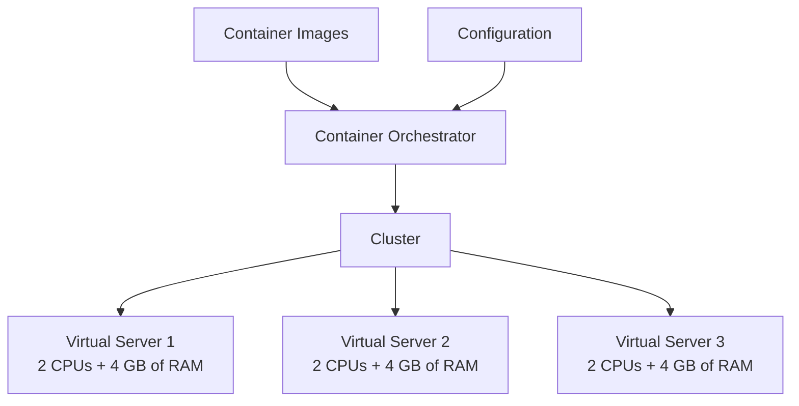

# Container Orchestration

Requirement: I want to run 10 instances of M1, 15 instances
of M2, and so on ...
Furthermore, I need:
- Auto Scaling --> Scale containers based on demand.
- Service Discovery --> Help microservices find each other.
- Load Balancer --> Distribute load among multiple instances.
- Self Healing --> Perform health checks and replace failing
instances.
- Zero Downtime Deployment --> Release new versions without
downtime.

Amazon Web Services provides:
- AWS Elastic Container Service (ECS)
- AWS Fargate: "Serverless" version of ECS.

However, a cloud neutral solution is given by:

# Kubernetes

Kubernetes can be run anywhere:
- AWS EKS = Elastic Kubernetes Service
- Microsoft AKS = Azure Kubernetes Service
- Google GKE = Google Kubernetes Engine --> Includes a free tier.



## Google Cloud Platform

1. Create a Google Cloud account (free $300 credits).
2. Create a GKE Cluster --> gcloud container clusters create or use cloud console.
    - Create a Kubernetes cluster with the default node pool:
    - Look for Kubernetes Engine
    - Enable the Kubernetes Engine API
    - Kubernetes Engine > **CREATE CLUSTER** > Cluster mode:
        - Standard (manual)
        - Autopilot (delegate to GKE) (Reduces costs).

### Useful Commands

```bash
gcloud config set project my-kubernetes-project-304910
gcloud container clusters get-credentials my-cluster --zone us-central1-c --project my-kubernetes-project-304910

kubectl create deployment hello-world-rest-api --image=in28min/hello-world-rest-api:0.0.1.RELEASE
kubectl get deployment
kubectl expose deployment hello-world-rest-api --type=LoadBalancer --port=8080
kubectl get services
kubectl get services --watch

curl 35.184.204.214:8080/hello-world

kubectl scale deployment hello-world-rest-api --replicas=3
gcloud container clusters resize my-cluster --node-pool default-pool --num-nodes=2 --zone=us-central1-c

kubectl autoscale deployment hello-world-rest-api --max=4 --cpu-percent=70
kubectl get hpa
kubectl create configmap hello-world-config --from-literal=RDS_DB_NAME=todos
kubectl get configmap
kubectl describe configmap hello-world-config
kubectl create secret generic hello-world-secrets-1 --from-literal=RDS_PASSWORD=dummytodos
kubectl get secret
kubectl describe secret hello-world-secrets-1
kubectl apply -f deployment.yaml

gcloud container node-pools list --zone=us-central1-c --cluster=my-cluster
kubectl get pods -o wide
kubectl set image deployment hello-world-rest-api hello-world-rest-api=in28min/hello-world-rest-api:0.0.2.RELEASE
kubectl get services
kubectl get replicasets
kubectl get pods
kubectl delete pod hello-world-rest-api-58dc9d7fcc-8pv7r
kubectl scale deployment hello-world-rest-api --replicas=1
kubectl get replicasets

gcloud projects list

kubectl delete service hello-world-rest-api
kubectl delete deployment hello-world-rest-api
gcloud container clusters delete my-cluster --zone us-central1-c
```

After creating the cluster, you will be able to see:

| Name | Location | Number of Nodes | Total vCPUs  | Total Memory |
| :--- | :---     |      :---:      |  :---:  | :---: |
| my-cluster | us-central1-c  | 3  | 6  |  12 GB |

3. Login to **Google Cloud Shell**, from which 
you can connect to this cluster:

```bash
gcloud config set project [PROJECT_ID]
# Google Cloud Platform will provide you with this command:
```

4. Connect to the Kubernetes Cluster
```bash
gcloud container clusters get-credentials my-cluster --zone us-central1-c --project my-kubernetes-project-123456
# Fetching cluster endpoint and auth data.
# kubeconfig entry generated for my-cluster
```

## `kubectl` --> Command Line Tool for Kubernetes

5. Deploy the microservice to Kubernetes:  
Create **deployment** + **service** using `kubectl` commands:

```bash
# This image must be already pushed to Docker Hub
kubectl create deployment hello-world-rest-api --image=neo_1042/hello-world-rest-api:0.0.1.RELEASE

kubectl get deployment
# Expose information about this deployment
kubectl expose deployment hello-world-rest-api --type=LoadBalancer --port=8080

kubectl get services
# NAME                  TYPE          CLUSTER-IP      EXTERNAL-IP     PORT(S)            AGE
# hello-world-rest-api  LoadBalancer  10.80.13.230     <pending>      8080:30095/TCP     26s
# kubernetes            ClusterIP     10.80.0.1        <none>         443/TCP            12m
```

When you expose a deployment, you create a service. Now, we wait the
external-ip to be assigned to this LoadBalancer. Let's monitor it:
```bash
kubectl get services --watch
# Now, the EXTERNAL-IP has been assigned:
# NAME                  TYPE          CLUSTER-IP      EXTERNAL-IP     PORT(S)            AGE
# hello-world-rest-api  LoadBalancer  10.80.13.230    35.184.204.214  8080:30095/TCP     26s
# kubernetes            ClusterIP     10.80.0.1        <none>         443/TCP            12m
```

Copy the `EXTERNAL-IP` value = 35.184.204.214 and curl it:
```bash
curl 35.184.204.214:8080
curl 35.184.204.214:8080/hello-world
```

## Google Kubernetes Engine > Clusters

When the Kubernetes Cluster was created using the Google Kubernetes Engine,
GKE created a Node Pool that contains nodes. One Kubernetes cluster can
contain multiple node pools.

Later, you can add a node pool that contains GPUs, for instance.

## Google Kubernetes Engine > Workloads

What is running in the cluster? Each instance that is part of a
deployment = **POD**.
```bash
# Google Cloud Shell:
kubectl get events
```

[+] In addition to deploying services to Kubernetes using the
Google Cloud Shell, you can use a YAML configuration file.

- Services ---> Sets of Pods with a network endpoint that can be used
for discovery and load balancing.
- Ingresses ---> Collections of rules for routing external HTTP(S) traffic
to Services.

## 6. Increase Number of Instances of your Microservices

```bash
# Google Cloud Shell
kubectl scale deployment hello-world-rest-api --replicas=3

# Validate how many instances are deployed
kubectl get deployment
watch curl EXTERNAL_IP:PORT

# View details on each instance (pod)
kubectl get pods
```

## 7. Manually Increase Number of Nodes in the Cluster

```bash
# Google Cloud Shell
# Manual Scaling of the Cluster:
gcloud container clusters resize my-cluster --node-pool default-pool --num-nodes=5 --zone=us-central1-c
# ... 10-15 minutes
```

How to automatically scale?

## 8. Setup Auto-Scaling for your Microservices. HPA

```bash
# Setting up a maximum of 4 instances, max CPU utilization of 70%
kubectl autoscale deployment hello-world-rest-api --max=4 --cpu-percent=70
```

**HPA** = Horizontal Pod Autoscaling.
```bash
kubectl get hpa
```

## 9. Setup Auto-Scaling for your Kubernetes Cluster

```bash
gcloud container clusters update cluster-name --enable-autoscaling --min-nodes=1 --max-nodes=10
```