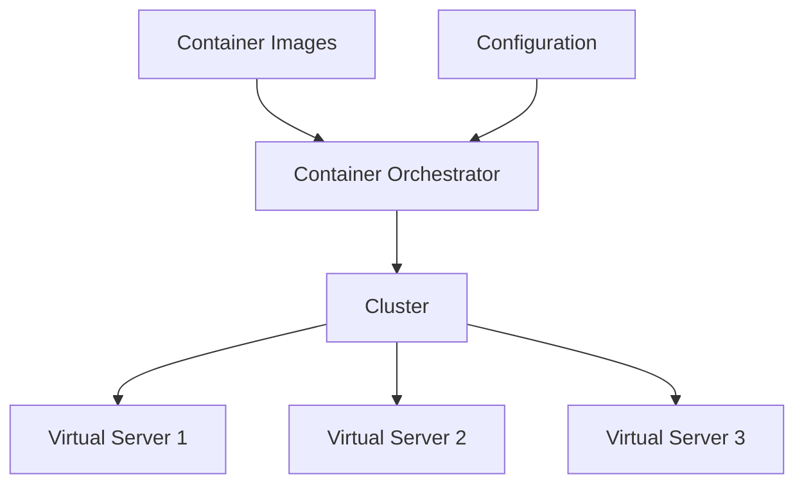

# Container Orchestration

Requirement: I want to run 10 instances of M1, 15 instances
of M2, and so on ...
Furthermore, I need:
- Auto Scaling --> Scale containers based on demand.
- Service Discovery --> Help microservices find each other.
- Load Balancer --> Distribute load among multiple instances.
- Self Healing --> Perform health checks and replace failing
instances.
- Zero Downtime Deployment --> Release new versions without
downtime.

Amazon Web Services provides:
- AWS Elastic Container Service (ECS)
- AWS Fargate: "Serverless" version of ECS.

However, a cloud neutral solution is given by:

# Kubernetes

Kubernetes can be run anywhere:
- AWS EKS = Elastic Kubernetes Service
- Microsoft AKS = Azure Kubernetes Service
- Google GKE = Google Kubernetes Engine --> Includes a free tier.



## Google Cloud Platform

1. Create a Google Cloud account (free $300 credits).
2. Create a GKE Cluster --> gcloud container clusters create or use cloud console.
    - Create a Kubernetes cluster with the default node pool:
    - Look for Kubernetes Engine
    - Enable the Kubernetes Engine API
    - Kubernetes Engine > **CREATE CLUSTER** > Cluster mode:
        - Standard (manual)
        - Autopilot (delegate to GKE) (Reduces costs).

### Useful Commands

```bash
gcloud config set project my-kubernetes-project-304910
gcloud container clusters get-credentials my-cluster --zone us-central1-c --project my-kubernetes-project-304910

kubectl create deployment hello-world-rest-api --image=in28min/hello-world-rest-api:0.0.1.RELEASE
kubectl get deployment
kubectl expose deployment hello-world-rest-api --type=LoadBalancer --port=8080
kubectl get services
kubectl get services --watch

curl 35.184.204.214:8080/hello-world

kubectl scale deployment hello-world-rest-api --replicas=3
gcloud container clusters resize my-cluster --node-pool default-pool --num-nodes=2 --zone=us-central1-c

kubectl autoscale deployment hello-world-rest-api --max=4 --cpu-percent=70
kubectl get hpa
kubectl create configmap hello-world-config --from-literal=RDS_DB_NAME=todos
kubectl get configmap
kubectl describe configmap hello-world-config
kubectl create secret generic hello-world-secrets-1 --from-literal=RDS_PASSWORD=dummytodos
kubectl get secret
kubectl describe secret hello-world-secrets-1
kubectl apply -f deployment.yaml

gcloud container node-pools list --zone=us-central1-c --cluster=my-cluster
kubectl get pods -o wide
kubectl set image deployment hello-world-rest-api hello-world-rest-api=in28min/hello-world-rest-api:0.0.2.RELEASE
kubectl get services
kubectl get replicasets
kubectl get pods
kubectl delete pod hello-world-rest-api-58dc9d7fcc-8pv7r
kubectl scale deployment hello-world-rest-api --replicas=1
kubectl get replicasets

gcloud projects list

kubectl delete service hello-world-rest-api
kubectl delete deployment hello-world-rest-api
gcloud container clusters delete my-cluster --zone us-central1-c
```